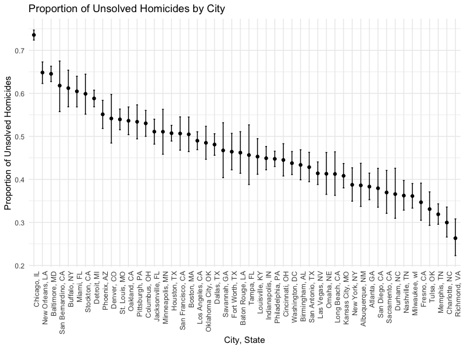

p8105_hw5_ys3766
================
Yifan Shi
2024-11-15

## Problem 1

``` r
bday_sim = function(n){

bdays = sample(1:365, size = n, replace = TRUE)

duplicate = length(unique(bdays)) < n

return(duplicate)
}

bday_sim(10)
```

    ## [1] FALSE

``` r
sim_res = 
  expand_grid(
    n = 2:50,
    iter = 1:10000
  ) %>% 
  mutate(res = map_lgl(n, bday_sim)) %>% 
  group_by(n) %>% 
  summarize(prob = mean(res)) 


sim_res %>% 
  ggplot(aes(x = n, y = prob))+
  geom_point()+
  geom_line()+
   ggtitle("Probability of Shared Birthdays by Group Size") +
  xlab("Group Size") +
  ylab("Probability of Shared Birthdays")
```


The plot shows the probability of at least two people in a group sharing
a birthday, with group size ranging from 2 to 50. The probability
increased with the size of the group. The probability exceeds 50% in
group with 23 or more people, and reached ~97% in a group of 50 people.

## Problem 2

``` r
simulate_t_tests <- function(mu, n = 30, sigma = 5, n_sim = 5000) {
  t_results <- replicate(n_sim, {
    data <- rnorm(n, mean = mu, sd = sigma)
    test_result <- t.test(data, mu = 0) %>%
                   broom::tidy() %>%
                   as_tibble()
    c(mu_hat = test_result %>% pull(estimate), 
      p_value = test_result %>% pull(p.value))
  })
  tibble(mu = mu, 
         mu_hat = t_results[1, ], 
         p_value = t_results[2, ])
}

mu_values <- 0:6
simulation_results <- map_df(mu_values, ~simulate_t_tests(.x, n = 30, sigma = 5, n_sim = 5000))
```

``` r
results_summary <- simulation_results %>%
  mutate(rejected = p_value < 0.05) %>%
  group_by(mu) %>%
  summarise(
    power = mean(rejected),
    avg_mu_hat = mean(mu_hat),
    avg_mu_hat_rejected = mean(mu_hat[rejected]),
    .groups = 'drop' 
  )
```

``` r
results_summary %>% 
  ggplot(
  aes(x = mu, y = power)) +
  geom_point() +
  geom_line() +
  labs(title = "Power of the Test as a Function of True Mean (mu)",
       x = "true value of mu", y = "Power")
```


``` r
results_summary %>%  
  ggplot(aes(x = mu)) +
  geom_point(aes(y = avg_mu_hat, color = "All Samples")) +
  geom_line(aes(y = avg_mu_hat, color = "All Samples"), linetype = "dashed") +
  geom_point(aes(y = avg_mu_hat_rejected, color = "Null Reject")) +
  geom_line(aes(y = avg_mu_hat_rejected, color = "Null Reject")) +
  labs(title = "Average Estimates of Mu",
       x = "True Mean (mu)", 
       y = "Average Estimate of Mu"
       )
```


The sample average of μ across tests where the null is rejected is
typically higher than the true μ, which is especially noticeable at
lower true μ values and tends to converge as μ increases.

When the null hypothesis is rejected, it is often because the sample
mean is sufficiently extreme compared to the hypothesized mean. In cases
where μ is closer to 0, but the null is rejected, it typically means
that the sample mean was unusually high (or low), leading to an
overestimate of μ. As μ increases, the likelihood of rejecting the null
hypothesis because of random variation rather than the actual effect
(i.e., the true μ) decreases, making the estimate more accurate.

## Problem 3

``` r
homicide_df = read_csv(file = "data/homicide-data.csv", 
                       na = c("Unknown", "NA", "")) %>% 
  mutate(
    reported_date = as.Date(as.character(reported_date), 
                            format = "%y%m%d"))
```

    ## Rows: 52179 Columns: 12
    ## ── Column specification ────────────────────────────────────────────────────────
    ## Delimiter: ","
    ## chr (8): uid, victim_last, victim_first, victim_race, victim_sex, city, stat...
    ## dbl (4): reported_date, victim_age, lat, lon
    ## 
    ## ℹ Use `spec()` to retrieve the full column specification for this data.
    ## ℹ Specify the column types or set `show_col_types = FALSE` to quiet this message.

``` r
summary(homicide_df)
```

    ##      uid            reported_date        victim_last        victim_first      
    ##  Length:52179       Min.   :2020-07-01   Length:52179       Length:52179      
    ##  Class :character   1st Qu.:2020-08-07   Class :character   Class :character  
    ##  Mode  :character   Median :2020-10-03   Mode  :character   Mode  :character  
    ##                     Mean   :2020-09-24                                        
    ##                     3rd Qu.:2020-11-08                                        
    ##                     Max.   :2020-12-12                                        
    ##                     NA's   :25881                                             
    ##  victim_race          victim_age     victim_sex            city          
    ##  Length:52179       Min.   :  0.0   Length:52179       Length:52179      
    ##  Class :character   1st Qu.: 22.0   Class :character   Class :character  
    ##  Mode  :character   Median : 28.0   Mode  :character   Mode  :character  
    ##                     Mean   : 31.8                                        
    ##                     3rd Qu.: 40.0                                        
    ##                     Max.   :102.0                                        
    ##                     NA's   :2999                                         
    ##     state                lat             lon          disposition       
    ##  Length:52179       Min.   :25.73   Min.   :-122.51   Length:52179      
    ##  Class :character   1st Qu.:33.77   1st Qu.: -96.00   Class :character  
    ##  Mode  :character   Median :38.52   Median : -87.71   Mode  :character  
    ##                     Mean   :37.03   Mean   : -91.47                     
    ##                     3rd Qu.:40.03   3rd Qu.: -81.76                     
    ##                     Max.   :45.05   Max.   : -71.01                     
    ##                     NA's   :60      NA's   :60

The homicide dataset comprises 52179 homicide cases from various U.S.
cities, spanning from 2020-07-01 to 2020-12-12. Key variables include
**victim details** (name, race, age, sex), **city** and **state** of the
incident, **geographical coordinates**, and **case disposition status**.
Notably, there is a significant amount of missing data, particularly for
`reported_date` (25881 entries missing) and `victim_age` (2999 entries
missing). The disposition statuses categorize whether cases remain open
or are closed without arrest.

``` r
homicide_summary <- homicide_df %>%
  mutate(city_state = paste(city, state, sep = ", ")) %>%
  group_by(city_state) %>%
  summarise(
    total_homicides = n(),
    unsolved_homicides = sum(disposition %in% c("Closed without arrest", "Open/No arrest"), na.rm = TRUE),
    .groups = 'drop'
  ) %>% 
  filter(city_state!="Tulsa, AL")

knitr::kable(homicide_summary)
```

| city_state         | total_homicides | unsolved_homicides |
|:-------------------|----------------:|-------------------:|
| Albuquerque, NM    |             378 |                146 |
| Atlanta, GA        |             973 |                373 |
| Baltimore, MD      |            2827 |               1825 |
| Baton Rouge, LA    |             424 |                196 |
| Birmingham, AL     |             800 |                347 |
| Boston, MA         |             614 |                310 |
| Buffalo, NY        |             521 |                319 |
| Charlotte, NC      |             687 |                206 |
| Chicago, IL        |            5535 |               4073 |
| Cincinnati, OH     |             694 |                309 |
| Columbus, OH       |            1084 |                575 |
| Dallas, TX         |            1567 |                754 |
| Denver, CO         |             312 |                169 |
| Detroit, MI        |            2519 |               1482 |
| Durham, NC         |             276 |                101 |
| Fort Worth, TX     |             549 |                255 |
| Fresno, CA         |             487 |                169 |
| Houston, TX        |            2942 |               1493 |
| Indianapolis, IN   |            1322 |                594 |
| Jacksonville, FL   |            1168 |                597 |
| Kansas City, MO    |            1190 |                486 |
| Las Vegas, NV      |            1381 |                572 |
| Long Beach, CA     |             378 |                156 |
| Los Angeles, CA    |            2257 |               1106 |
| Louisville, KY     |             576 |                261 |
| Memphis, TN        |            1514 |                483 |
| Miami, FL          |             744 |                450 |
| Milwaukee, wI      |            1115 |                403 |
| Minneapolis, MN    |             366 |                187 |
| Nashville, TN      |             767 |                278 |
| New Orleans, LA    |            1434 |                930 |
| New York, NY       |             627 |                243 |
| Oakland, CA        |             947 |                508 |
| Oklahoma City, OK  |             672 |                326 |
| Omaha, NE          |             409 |                169 |
| Philadelphia, PA   |            3037 |               1360 |
| Phoenix, AZ        |             914 |                504 |
| Pittsburgh, PA     |             631 |                337 |
| Richmond, VA       |             429 |                113 |
| Sacramento, CA     |             376 |                139 |
| San Antonio, TX    |             833 |                357 |
| San Bernardino, CA |             275 |                170 |
| San Diego, CA      |             461 |                175 |
| San Francisco, CA  |             663 |                336 |
| Savannah, GA       |             246 |                115 |
| St. Louis, MO      |            1677 |                905 |
| Stockton, CA       |             444 |                266 |
| Tampa, FL          |             208 |                 95 |
| Tulsa, OK          |             583 |                193 |
| Washington, DC     |            1345 |                589 |

``` r
baltimore_result <- homicide_summary %>%
  filter(city_state == "Baltimore, MD") %>%
  summarise(prop_test_result = list(prop.test(unsolved_homicides, total_homicides))) %>%
  mutate(tidy_result = map(prop_test_result, broom::tidy)) %>%
  unnest(tidy_result) %>% 
  select(estimate,conf.low, conf.high)
  

knitr::kable(baltimore_result, 
             col.names = c("Estimate", "Lower CI", "Upper CI"),
             caption = "Proportion of Unsolved Homicides in Baltimore, MD")
```

|  Estimate |  Lower CI |  Upper CI |
|----------:|----------:|----------:|
| 0.6455607 | 0.6275625 | 0.6631599 |

Proportion of Unsolved Homicides in Baltimore, MD

``` r
unsolved_prop <-  function(unsolved, total){
  prop_test_result <- prop.test(unsolved, total)
  broom::tidy(prop_test_result) %>% 
    select(estimate, conf.low, conf.high)
}

homicide_test <- homicide_summary %>% 
  mutate(
    prop_results = purrr::map2(unsolved_homicides, total_homicides, ~unsolved_prop(.x, .y))
  ) %>%
  unnest(prop_results)

knitr::kable(homicide_test)
```

| city_state         | total_homicides | unsolved_homicides |  estimate |  conf.low | conf.high |
|:-------------------|----------------:|-------------------:|----------:|----------:|----------:|
| Albuquerque, NM    |             378 |                146 | 0.3862434 | 0.3372604 | 0.4375766 |
| Atlanta, GA        |             973 |                373 | 0.3833505 | 0.3528119 | 0.4148219 |
| Baltimore, MD      |            2827 |               1825 | 0.6455607 | 0.6275625 | 0.6631599 |
| Baton Rouge, LA    |             424 |                196 | 0.4622642 | 0.4141987 | 0.5110240 |
| Birmingham, AL     |             800 |                347 | 0.4337500 | 0.3991889 | 0.4689557 |
| Boston, MA         |             614 |                310 | 0.5048860 | 0.4646219 | 0.5450881 |
| Buffalo, NY        |             521 |                319 | 0.6122841 | 0.5687990 | 0.6540879 |
| Charlotte, NC      |             687 |                206 | 0.2998544 | 0.2660820 | 0.3358999 |
| Chicago, IL        |            5535 |               4073 | 0.7358627 | 0.7239959 | 0.7473998 |
| Cincinnati, OH     |             694 |                309 | 0.4452450 | 0.4079606 | 0.4831439 |
| Columbus, OH       |            1084 |                575 | 0.5304428 | 0.5002167 | 0.5604506 |
| Dallas, TX         |            1567 |                754 | 0.4811742 | 0.4561942 | 0.5062475 |
| Denver, CO         |             312 |                169 | 0.5416667 | 0.4846098 | 0.5976807 |
| Detroit, MI        |            2519 |               1482 | 0.5883287 | 0.5687903 | 0.6075953 |
| Durham, NC         |             276 |                101 | 0.3659420 | 0.3095874 | 0.4260936 |
| Fort Worth, TX     |             549 |                255 | 0.4644809 | 0.4222542 | 0.5072119 |
| Fresno, CA         |             487 |                169 | 0.3470226 | 0.3051013 | 0.3913963 |
| Houston, TX        |            2942 |               1493 | 0.5074779 | 0.4892447 | 0.5256914 |
| Indianapolis, IN   |            1322 |                594 | 0.4493192 | 0.4223156 | 0.4766207 |
| Jacksonville, FL   |            1168 |                597 | 0.5111301 | 0.4820460 | 0.5401402 |
| Kansas City, MO    |            1190 |                486 | 0.4084034 | 0.3803996 | 0.4370054 |
| Las Vegas, NV      |            1381 |                572 | 0.4141926 | 0.3881284 | 0.4407395 |
| Long Beach, CA     |             378 |                156 | 0.4126984 | 0.3629026 | 0.4642973 |
| Los Angeles, CA    |            2257 |               1106 | 0.4900310 | 0.4692208 | 0.5108754 |
| Louisville, KY     |             576 |                261 | 0.4531250 | 0.4120609 | 0.4948235 |
| Memphis, TN        |            1514 |                483 | 0.3190225 | 0.2957047 | 0.3432691 |
| Miami, FL          |             744 |                450 | 0.6048387 | 0.5685783 | 0.6400015 |
| Milwaukee, wI      |            1115 |                403 | 0.3614350 | 0.3333172 | 0.3905194 |
| Minneapolis, MN    |             366 |                187 | 0.5109290 | 0.4585150 | 0.5631099 |
| Nashville, TN      |             767 |                278 | 0.3624511 | 0.3285592 | 0.3977401 |
| New Orleans, LA    |            1434 |                930 | 0.6485356 | 0.6231048 | 0.6731615 |
| New York, NY       |             627 |                243 | 0.3875598 | 0.3494421 | 0.4270755 |
| Oakland, CA        |             947 |                508 | 0.5364308 | 0.5040588 | 0.5685037 |
| Oklahoma City, OK  |             672 |                326 | 0.4851190 | 0.4467861 | 0.5236245 |
| Omaha, NE          |             409 |                169 | 0.4132029 | 0.3653146 | 0.4627477 |
| Philadelphia, PA   |            3037 |               1360 | 0.4478103 | 0.4300380 | 0.4657157 |
| Phoenix, AZ        |             914 |                504 | 0.5514223 | 0.5184825 | 0.5839244 |
| Pittsburgh, PA     |             631 |                337 | 0.5340729 | 0.4942706 | 0.5734545 |
| Richmond, VA       |             429 |                113 | 0.2634033 | 0.2228571 | 0.3082658 |
| Sacramento, CA     |             376 |                139 | 0.3696809 | 0.3211559 | 0.4209131 |
| San Antonio, TX    |             833 |                357 | 0.4285714 | 0.3947772 | 0.4630331 |
| San Bernardino, CA |             275 |                170 | 0.6181818 | 0.5576628 | 0.6753422 |
| San Diego, CA      |             461 |                175 | 0.3796095 | 0.3354259 | 0.4258315 |
| San Francisco, CA  |             663 |                336 | 0.5067873 | 0.4680516 | 0.5454433 |
| Savannah, GA       |             246 |                115 | 0.4674797 | 0.4041252 | 0.5318665 |
| St. Louis, MO      |            1677 |                905 | 0.5396541 | 0.5154369 | 0.5636879 |
| Stockton, CA       |             444 |                266 | 0.5990991 | 0.5517145 | 0.6447418 |
| Tampa, FL          |             208 |                 95 | 0.4567308 | 0.3881009 | 0.5269851 |
| Tulsa, OK          |             583 |                193 | 0.3310463 | 0.2932349 | 0.3711192 |
| Washington, DC     |            1345 |                589 | 0.4379182 | 0.4112495 | 0.4649455 |

``` r
ggplot(homicide_test, aes(x = reorder(city_state, -estimate), y = estimate)) +
  geom_point() +
  geom_errorbar(aes(ymin = conf.low, ymax = conf.high), width = 0.2) +
  labs(
    title = "Proportion of Unsolved Homicides by City",
    x = "City, State",
    y = "Proportion of Unsolved Homicides"
  ) +
  theme(axis.text.x = element_text(angle = 90, hjust = 1))  
```


