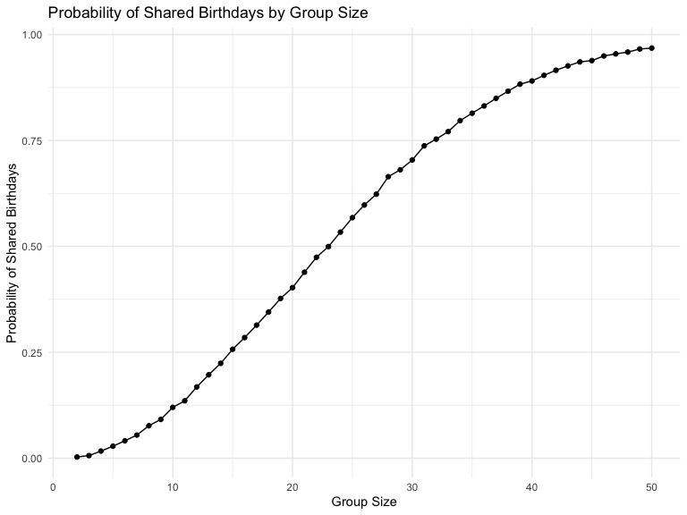
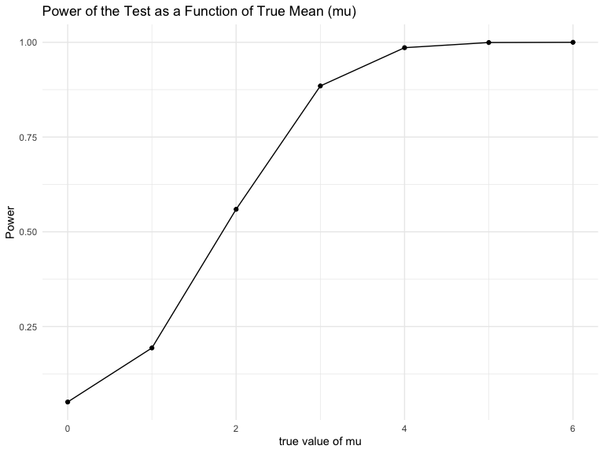
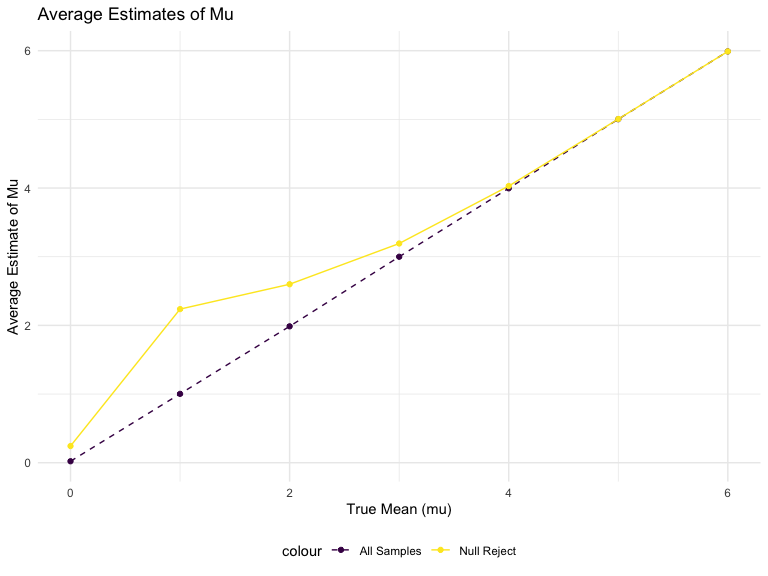

p8105_hw5_ys3766
================
Yifan Shi
2024-11-15

## Problem 1

``` r
bday_sim = function(n){

bdays = sample(1:365, size = n, replace = TRUE)

duplicate = length(unique(bdays)) < n

return(duplicate)
}

bday_sim(10)
```

    ## [1] FALSE

``` r
sim_res = 
  expand_grid(
    n = 2:50,
    iter = 1:10000
  ) %>% 
  mutate(res = map_lgl(n, bday_sim)) %>% 
  group_by(n) %>% 
  summarize(prob = mean(res)) 


sim_res %>% 
  ggplot(aes(x = n, y = prob))+
  geom_line()+
   ggtitle("Probability of Shared Birthdays by Group Size") +
  xlab("Group Size") +
  ylab("Probability of Shared Birthdays")
```



The plot shows the probability of at least two people in a group sharing
a birthday, with group size ranging from 2 to 50. The probability
increased with the size of the group. The probability exceeds 50% in
group with 23 or more people, and reached ~97% in a group of 50 people.

## Problem 2

``` r
simulate_t_tests <- function(mu, n = 30, sigma = 5, n_sim = 5000) {
  t_results <- replicate(n_sim, {
    data <- rnorm(n, mean = mu, sd = sigma)
    test_result <- t.test(data, mu = 0) %>%
                   broom::tidy() %>%
                   as_tibble()
    c(mu_hat = test_result %>% pull(estimate), 
      p_value = test_result %>% pull(p.value))
  })
  tibble(mu = mu, 
         mu_hat = t_results[1, ], 
         p_value = t_results[2, ])
}

mu_values <- 0:6
simulation_results <- map_df(mu_values, ~simulate_t_tests(.x, n = 30, sigma = 5, n_sim = 5000))
```

``` r
results_summary <- simulation_results %>%
  mutate(rejected = p_value < 0.05) %>%
  group_by(mu) %>%
  summarise(
    power = mean(rejected),
    avg_mu_hat = mean(mu_hat),
    avg_mu_hat_rejected = mean(mu_hat[rejected]),
    .groups = 'drop' 
  )
```

``` r
results_summary %>% 
  ggplot(
  aes(x = mu, y = power)) +
  geom_point() +
  geom_line() +
  labs(title = "Power of the Test as a Function of True Mean (mu)",
       x = "true value of mu", y = "Power")
```



``` r
results_summary %>%  
  ggplot(aes(x = mu)) +
  geom_point(aes(y = avg_mu_hat, color = "All Samples")) +
  geom_line(aes(y = avg_mu_hat, color = "All Samples"), linetype = "dashed") +
  geom_point(aes(y = avg_mu_hat_rejected, color = "Null Reject")) +
  geom_line(aes(y = avg_mu_hat_rejected, color = "Null Reject")) +
  labs(title = "Average Estimates of Mu",
       x = "True Mean (mu)", 
       y = "Average Estimate of Mu"
       )
```



The sample average of μ across tests where the null is rejected is
typically higher than the true μ, which is especially noticeable at
lower true μ values and tends to converge as μ increases.

When the null hypothesis is rejected, it is often because the sample
mean is sufficiently extreme compared to the hypothesized mean. In cases
where μ is closer to 0, but the null is rejected, it typically means
that the sample mean was unusually high (or low), leading to an
overestimate of μ. As μ increases, the likelihood of rejecting the null
hypothesis because of random variation rather than the actual effect
(i.e., the true μ) decreases, making the estimate more accurate.
